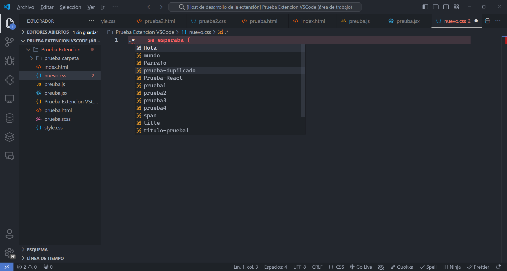

# Auto Class Complete README

Auto Class Complete es una extensión diseñada para optimizar tu flujo de trabajo en desarrollo web, permitiéndote autocompletar clases CSS directamente desde archivos HTML y JSX. Esta herramienta te ayuda a evitar errores tipográficos al sugerir automáticamente las clases disponibles en tu proyecto, eliminando la necesidad de alternar entre archivos para verificar nombres de clases.

## Características

### Autocompletado Eficiente

Detecta y sugiere clases CSS de tus archivos HTML y JSX mientras escribes, lo que te permite seleccionar fácilmente las clases correctas sin interrupciones en tu flujo de trabajo.

### Soporte para Varios Tipos de Archivos

Funciona con archivos .html, .jsx y .js, facilitando el desarrollo en proyectos que utilizan React y otros frameworks basados en JavaScript.

### Minimización de Errores Tipográficos

Reduce significativamente los errores tipográficos al proporcionar sugerencias de autocompletado precisas, lo que mejora la calidad del código y la eficiencia del desarrollo.

### Configuración Personalizada

Ofrece opciones para personalizar qué tipos de archivos deseas incluir en el autocompletado a través de la configuración de la extensión.

## Cómo Funciona

### Instalación

Descarga Auto Class Complete desde el Marketplace de Visual Studio o Visual Studio Code.

### Uso

Al escribir una asterisco (\*) en un archivo CSS, se mostrará una lista de sugerencias de clases CSS basadas en los archivos HTML y JSX del proyecto. Simplemente selecciona la clase deseada y continúa con tu trabajo.

### Configuración

Personaliza la extensión desde la configuración del editor para incluir solo los tipos de archivos que necesitas.

## Ejemplo de Uso

A continuación, se muestra un ejemplo visual de cómo Auto Class Complete facilita el autocompletado de clases CSS:

## Contribuciones

Si deseas contribuir al desarrollo de Auto Class Complete, no dudes en abrir un problema o enviar un pull request en nuestro repositorio de GitHub.

## Requisitos

- Visual Studio o Visual Studio Code (versión compatible).
- Archivos HTML y JSX disponibles en el proyecto.

## Contacto

Para preguntas, comentarios o soporte, puedes contactarnos en [emilianoariel6@gmail.com].
